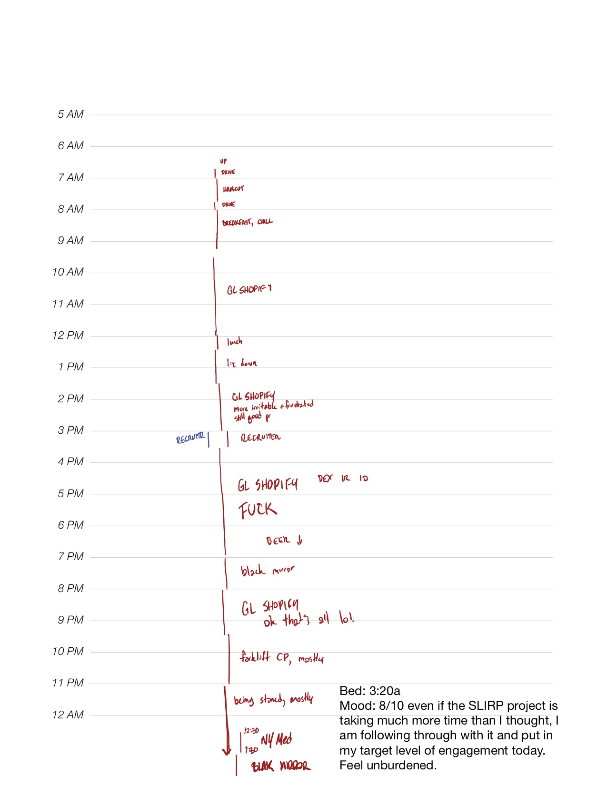
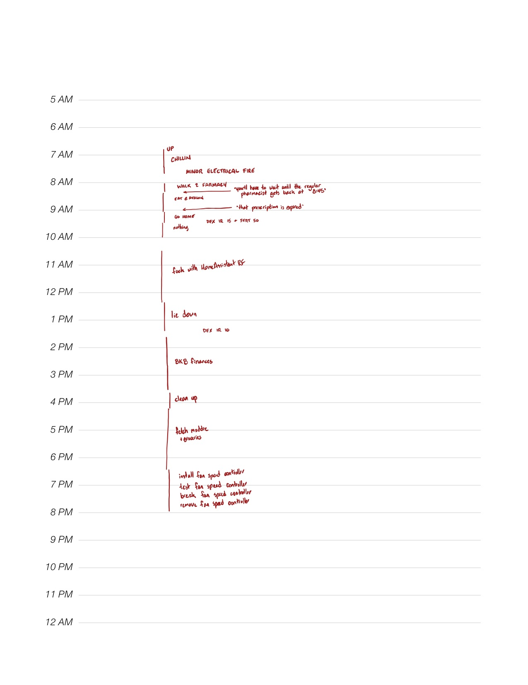
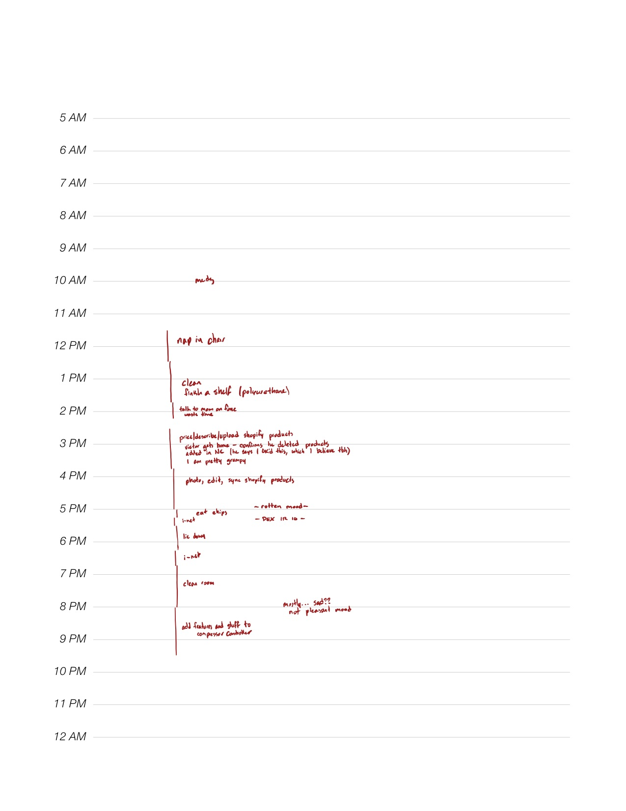
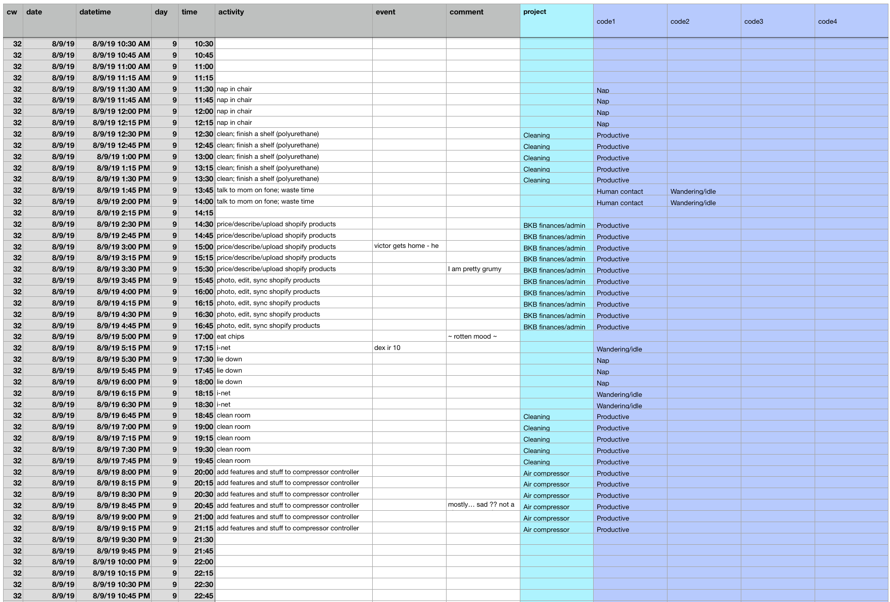

A few notes on how I recorded what I was doing.

### Timesheet capture
At the beginning of the year, I knew that I wanted to track a lot of things, but I didn't know exactly what they were yet. I also didn't want to get stuck halfway through the year by coming up with a new metric to track and realizing I hadn't been recording it for the last however-many months. My solution was to record everything.

	

		

			

				
			

			

				<a href="assets/timesheet1.jpg" target="_new">June 14, 2019</a>
			

		

	

	

		

			

				
			

			

				<a href="assets/timesheet2.jpg" target="_new">May 17, 2019</a>
			

		

	

	

		

			

				
			

			

				<a href="assets/timesheet3.jpg" target="_new">August 9, 2019</a>
			

		

	

I'm a big fan of the iPad Pro and the Apple Pencil for doing computer work that doesn't feel like you're using a computer. Every day, I make a new copy of my [hourly planner template](assets/hourly-planner-template.pdf) in my notebook app ([Notability](https://apps.apple.com/us/app/notability/id360593530)). As the day goes on, I'll scribble what I'm doing in red ink. If I get around to blocking my day out ahead of time, I'll do that on the same sheet with blue ink, and then fill in my actual activities next to it.

The format of the template limits my maximum precision to about 15 minutes, which works out pretty well. I think it would be difficult to try and record activities down to the minute with this manual method. 15-minute intervals make for a good compromise between data quality and time investment/personal sanity.

As the year went on, I settled into a sort of standard format for the timesheet:

* Activities with a duration ("took a nap, 4:00 - 4:45") get written in red ink in a column down the page.
* Events ("took 2 ibuprofen", "woke up") get written a little bit to the right.
* When I have comments ("this is going very well", "this room is so hot I think I am going to die"), they get scribbled at about the time I make them.
* At the end of most days, I write a quick note about my mood throughout the day and score my average mood from 1 to 10. (More on this on the [mood score plot page](/projects/{{page.project-slug}}/plots/mood-over-time-trend.html).)

### Importing and categorizing data
The benefit of the "write down everything that happens" timesheet format is its flexibility: I feel pretty confident that I'll be able to do a broad range of analyses on my time data if I want to. The downside is that all of the timesheets need to be processed before they're usable for analysis.

Right now, this happens in a spreadsheet that I'm almost embarrassed to post a picture of:

	

	

		

			

				
			

			

				The data from August 9's timesheet, imported and tagged in the Spreadsheet of I Guess This Works
			

		

	

	

I processed timesheets once a month, in two passes. On the first pass, I only dump what's in the timesheets directly into the spreadsheet (no tagging, categorizing, or analysis). On the second pass, I assign tags and projects to each activity.

Data import takes me 1.5-2 hours a month, and tagging/categorizing adds another 2 hours on top of that. This isn't actually too terrible, but once a month isn't often enough for me to get fast feedback from my timesheet data. Improving the timesheet data capture process is pretty high on the list of improvements for 2020.

#### Tags and projects
Each 15-minute interval can have up to one _project_, and as many _tags_ as I want. (The spreadsheet only has four tag columns, but that's not a hard limit.)

Early in the year, I kinda made up my tags as I went along, mostly according to the things I wanted to be tracking. Later, I realized that I needed to tighten up the tag definitions if I wanted them to be useful for analysis. For example, I originally had a `maladaptive` tag that was supposed to represent times when I reacted poorly to a stressful or unpleasant situation (say, by taking a nap instead of fixing what was wrong). But `maladaptive` quickly overlapped quite a bit with `nap`, and then things got squishy: how do I distinguish naps I took because I was tired, but when I also happened to be facing a tricky problem?

About halfway through the year, I tried to write clear criteria for the tags. Here are some examples:

	

	

		<table class="table table-sm">
			<caption>Activity tags and their criteria</caption>
			<thead>
				<tr>
					<th>Tag</th><th>Criteria</th>
				</tr>
			</thead>
			<tbody>
				<tr>
					<td>Nap</td>
					<td>
						<ul>
							<li>Sleeping that happens after the first wake of the day (when I get out of bed from the previous night’s sleep), and after the daily wake time (8am).</li>
							<li>Not: Oversleeping.</li>
						</ul>
					</td>
				</tr>
				<tr>
					<td>Productive</td>
					<td>
						<ul>
							<li>Cooking / meal-prep that generates leftovers</li>
							<li>intentional activity that generates some useful output (e.g. designing things, etc)</li>
							<li>intentional activity that checks a to-do item</li>
							<li>NOT: intentional activity for valid/good but non-output-generating reasons - e.g., stretching out, exercising, etc</li>
						</ul>
					</td>
				</tr>
				<tr>
					<td>Wandering/idle</td>
					<td>
						<ul>
							<li>snack breaks that last longer than 30 minutes</li>
							<li>Activities noted “waste time”, “nothing”, “tinkering”, “putzing”, “unnecessary”, “wander”/“wandering”, “I-net”</li>
						</ul>
					</td>
				</tr>
			</tbody>
		</table>
	

	

### Analysis and plotting
I won't get too deep into my toolchain for making plots here - I think it will probably be boring to most of the folks reading this. (If you want to know more about it, I'm happy to share code and such - it's nothing special.)

Briefly:

- A quick, hacky Python script imports the timesheet data from spreadsheets and writes it to a MySQL DB on a server here at my house.
- I do most of my analysis in [Jupyter](https://jupyter.org) notebooks now (although I still miss Mathematica). I write queries to pull structured data into [pandas](https://pandas.pydata.org) and then put together plots with [Plotly](https://plot.ly/python/).
  - Plotly is not my favorite graphing library of all time, but it does most things pretty well. I don't know why I don't like matplotlib.
- As I generate and update figures in my Jupyter notebook, a function writes styled/formatted plot images with the correct dimensions to the source directory of this website. Plotly can also spit out HTML `
` elements containing interactive versions of the plots, and I generate those as well (for the plot detail pages).
- [Jekyll](https://jekyllrb.com) renders my pages into HTML and structures them, and I host the whole thing on [GitHub Pages](https://pages.github.com).

This is sort of a zombified version of a toolchain that I put together when I was in school for compiling homework assignment reports (back then, it was MATLAB dumping .eps figures into a folder that LaTeX compiled into a PDF). I'm a big fan of automatically-updated report outputs - it means that as I go back through and tweak plot formatting, analysis parameters, etc., the images on the website automatically update themselves to match.

I put this stuff on a MySQL host (as opposed to, say, SQLite) because I hope to have live dashboards of this data later on, using [Grafana](https://grafana.com) or [Metabase](https://www.metabase.com). That's still on down the road.
