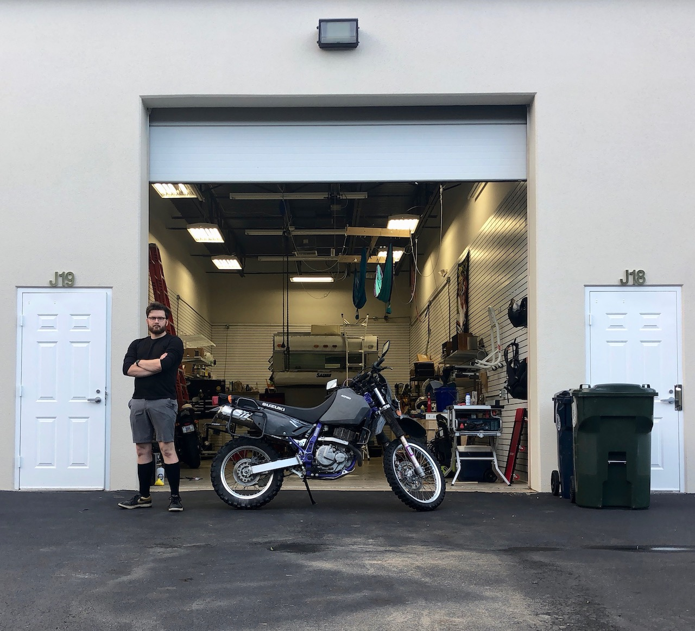

I spent all of 2019 collecting data on what I did all day, almost every day.

At the beginning of this year, I was newly unemployed, living in a storage unit in Cornelius, NC, without much of a plan. I was a little lost.

This was actually supposed to be a dream setup for me. I had a little bit of severance pay, a shop, and a huge backlog of projects I was aching to get done.

Instead of an indefinite Maker Vacation, though, I found myself more stymied than I had ever been with a day job. My energy levels were in the pits. I spent day after day puttering around the shop, feeling overwhelmed, wanting to go back to sleep. I would get things done, sure, but no part of the process was enjoyable, and when I finished a task, I felt just as underwater as when I'd begun. Something was out of whack.

More frustratingly, I knew there were days when everything clicked, and I was <u>on</u>. I also knew that there were *years* of my life where I had been engaged, energetic, and passionate every single day. What had changed between then and now? And what made my good days different from my bad days?

My question at the beginning of 2019, then: 

> Why am I so shitty at doing the things that I *want* to do?

This project is the result of me collecting data on my behavior over the course of the year to try and answer that question. I'll put up some more details on my data-capture tools on the [methods page](methods/). The fun stuff is over on the [plots and visualization page](plots/).